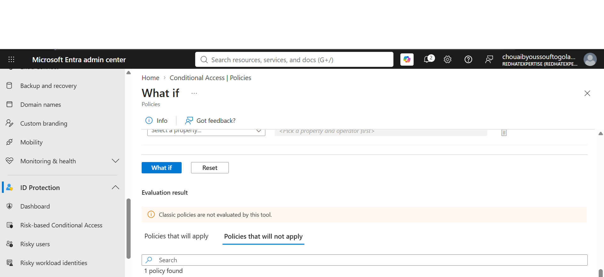
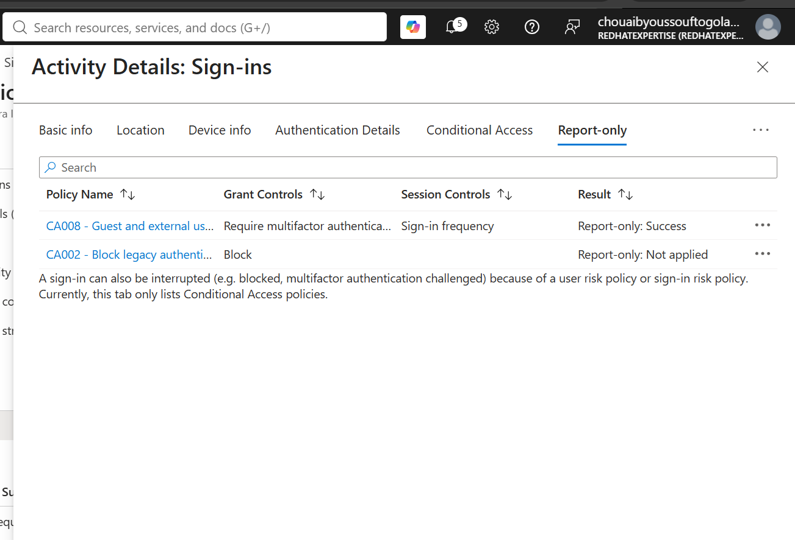

## Scenario 1 — Employee challenged for MFA with none registered

**Policy:** CA001 - Require MFA for all users
**Date tested:** 2026-09-19
**Objective:** Demonstrates that a baseline MFA requirement correctly identifies and challenges an employee who has no MFA method registered.

**Setup:**
- User: Sarah Chen (test employee, no MFA registered)
- Starting state: report-only mode first, then policy switched to enforcing

**Expected result:** Challenged / blocked until MFA is registered
**Actual result:** Report-only mode showed "Report-only: Failure" for this user (would have been blocked). After switching CA001 to On, signing in as this user triggered a live "more information required" prompt, forcing MFA registration before access was granted.

**Evidence:**
- 
 sign-in log, Conditional Access tab
- `CA001-policy.json` — exported policy definition

**Business takeaway:**
Requiring MFA tenant-wide closes the single most common gap exploited in real breaches — a stolen or guessed password with nothing else standing in the way.

---

## Scenario 2 — Legacy authentication client blocked, modern browser unaffected

**Policy:** CA002 - Block legacy authentication
**Date tested:** 2026-09-19
**Objective:** Demonstrates that legacy authentication protocols (IMAP/POP/older SMTP, which can't support MFA at all) are blocked outright, while normal browser sign-ins remain unaffected.

**Setup:**
- Simulated via the Conditional Access What-If tool (no real legacy client available)
- Test 1: Client apps = "Other clients" (represents legacy protocols)
- Test 2: Client apps = "Browser" (represents normal modern sign-in)

**Expected result:** Legacy client blocked; browser sign-in unaffected
**Actual result:** What-If confirmed CA002 under "Policies that will apply" with grant control "Block access" for the legacy client simulation, and under "Policies that will not apply" for the browser simulation.

**Evidence:**
- `[your CA002 legacy-blocked screenshot filename]` — What-If result, legacy client
- `[your CA002 browser-unaffected screenshot filename]` — What-If result, browser
- `CA002-policy.json` — exported policy definition (if you have this exported; if not, note it as pending)

**Business takeaway:**
Legacy protocols can only send a username and password — there's no mechanism for them to respond to an MFA challenge — making them a favorite target for credential-stuffing attacks. Blocking them outright, rather than trying to "challenge" them, is the only meaningful control.

---
----------
## [Scenario 3] —  Admin blocked without phishing-resistant auth 

**Policy:** CA004 - Require phishing-resistant MFA for Tier0 admins 
**Date tested:** 9/19/2026
**Objective:** Demonstrates that privileged accounts must use FIDO2/Windows Hello/certificate-based auth, not SMS or regular push MFA

**Setup:**
- User: YounoussK / Security Engineer
- Starting state:  no phishing-resistant method registered

**Expected result:** Blocked/Challenged for admin, Not applied for regular employee
**Actual result:**   Conditional Access: CA004 enforced

**Evidence:**

 for the admin user

 

- [CA004-policy.json](../policies/CA004-policy.json) — exported policy definition
**Business takeaway (1–2 sentences for the README/LinkedIn):**

Even if an admin's password and regular MFA are phished, this policy prevents sign-in without a phishing-resistant method.
This closes a gap where privileged accounts, if compromised via phishing, could otherwise authenticate with a simple SMS code. Requiring phishing-resistant MFA for Tier0 admins removes that path entirely.
<<<<<<< HEAD
=======

------------
## Scenario 4 — Guest restricted, with a redemption-flow detour

**Policy:** CA008 - Guest and external user restrictions
**Date tested:** 2026-09-20
**Objective:** Demonstrates that guest/external accounts are required to complete MFA and are subject to shorter sign-in frequency than regular employees.

**Setup:**
- User: MyGuest (test guest account, invited via B2B collaboration)
- Starting state: freshly invited, no MFA method registered

**Expected result:** Guest challenged for MFA and subject to session restrictions
**Actual result:** More interesting than expected — see the twist below

**What actually happened:**
The first sign-in attempt landed on the **Microsoft Invitation Acceptance Portal** (the app guests hit mid-redemption, before they're fully provisioned as a guest in the tenant). This attempt showed status **"Interrupted"**, with the reason "user was presented options to provide contact options so they can do MFA"; and critically, **CA008 did not appear at all** in this sign-in's Conditional Access tab, only CA001 (MFA for all users) and CA004 (not applied, correctly, since this account isn't a Tier0 admin).

After completing MFA registration and fully landing as a redeemed guest, a second, fresh sign-in to **My Apps** showed CA008 correctly evaluating with result **"Report-only: Success"**, along with the expected grant control (Require MFA) and session control (Sign-in frequency).

**Takeaway:** Conditional Access evaluation for guests can differ depending on which stage of the B2B redemption flow they're in — a policy scoped to "Guest or external users" may not evaluate identically during the invitation-acceptance step itself versus a normal resource sign-in afterward. Worth testing against a fully-redeemed guest, not just the initial invite acceptance, to get an accurate picture of enforcement.

**Evidence:**
- `ca008-guest-report-only-success.png` — Conditional Access tab, My Apps sign-in, CA008 = Report-only: Success
- `CA008-policy.json` — exported policy definition

---
